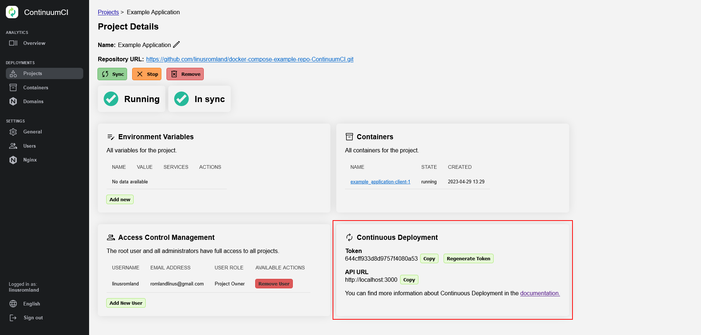

# Setting up ContinuumCI Deployment with GitHub Actions

This guide will walk you through setting up ContinuumCI deployment. With this setup, you can deploy your project to ContinuumCI automatically on every push to your default branch.

Before you begin, make sure that your project is set up to work with Docker Compose and that it is hosted on GitHub or GitLab.

## Step 1: Set up your project for deployment

Before setting up ContinuumCI deployment to GitHub Actions, make sure that your project is on GitHub and set up to work with Docker Compose. This involves configuring Docker Compose to run your project and ensuring that your project can be built and run locally.

Once your project is set up to work with Docker Compose, you can proceed to the next step.

## Step 2: Get your ContinuumCI API URL and CD Token

To set up ContinuumCI deployment with GitHub Actions, you'll need your ContinuumCI API URL and CD token. You can find these by going to your ContinuumCI website, selecting the project you want to deploy, and going to the "CD Deployment" tab.

Take note of the API URL and CD token, as you'll need these in the next step.

To continue, you'll need to go to the corresponding GitHub or GitLab guide:

-   [Setting up ContinuumCI Deployment with GitHub Actions](./github.md)
-   [Setting up ContinuumCI Deployment with GitLab CI/CD](./gitlab.md)
