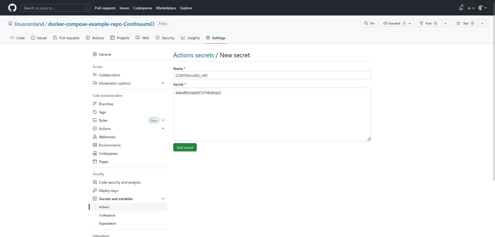
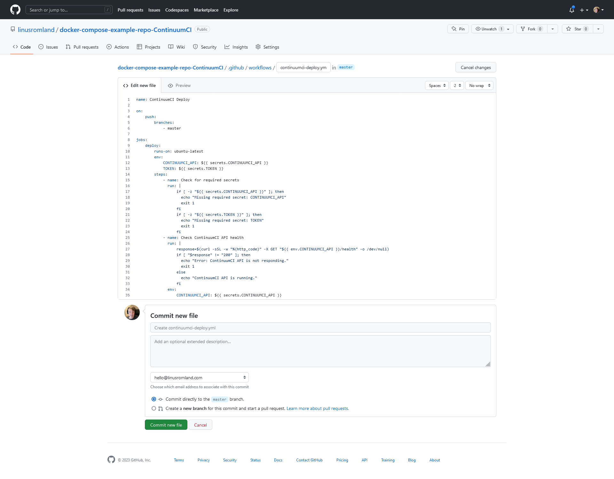

# Setting up ContinuumCI Deployment with GitHub Actions

Before you begin, make sure that you have followed the first step of the [Getting Started](./README.md) guide.

This guide will walk you through with the contiuation of the [Getting Started](./README.md) guide and set it up with GitHub and GitHub Actions.

## Step 1: Add secrets to your GitHub repository

In order for your GitHub Actions workflow to access your ContinuumCI API URL and CD token, you'll need to add them as secrets to your GitHub repository.

To add these secrets, go to your repository on GitHub and click on "Settings". Then, click on "Secrets" and click "New repository secret".

Add two secrets with the names CONTINUUMCI_API and TOKEN, and set their values to your ContinuumCI API URL and CD token, respectively.

## Step 2: Create a GitHub Actions workflow

To set up ContinuumCI deployment with GitHub Actions, you'll need to create a new workflow file in your repository. This workflow file will define the steps that GitHub Actions will take when deploying your project.

Create a new file in the `.github/workflows/` directory of your repository called `continuumci-deploy.yml`. Copy and paste the code from the [example file](../../examples/github-action.yml).

This workflow file will define the steps that GitHub Actions will take when deploying your project. It will also define the environment variables that GitHub Actions will use when running these steps.

**Note:** If you are using a different branch as your default branch, you will need to change the value of the branches key in the on section of the workflow file.

## Step 3: Commit and push your changes

Once you've created your workflow file, commit and push your changes to your repository. This will trigger GitHub Actions to run your workflow and deploy your project to ContinuumCI.

## Step 4: Verify that your project was deployed successfully

Once the file is committed and pushed, you can verify that your project was deployed successfully by checking the job status on GitHub. Just click on the "Actions" tab in your repository and look for the job named "ContinuumCI Deploy".

If the job was successful, you should see a green checkmark next to it. If the job failed, you should see a red X next to it, you can click on the job to see the logs and find out what went wrong.

