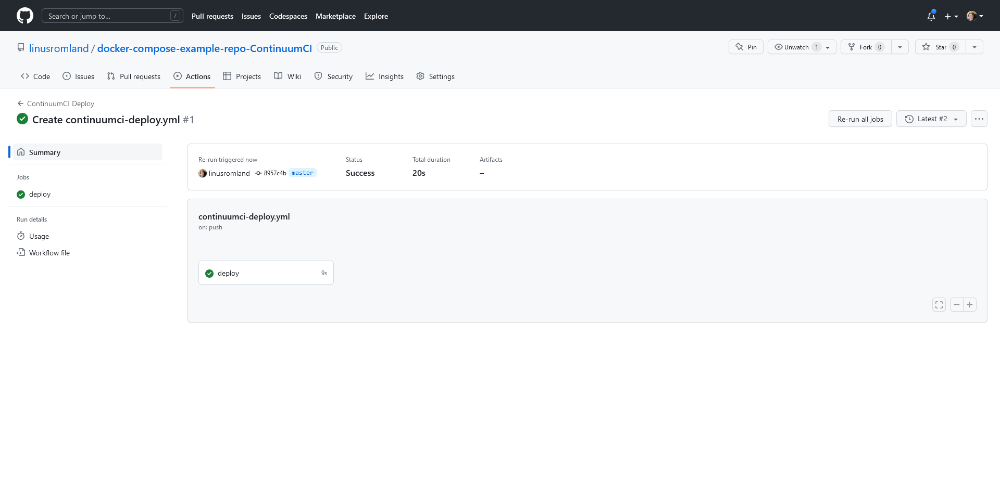

# Setting up ContinuumCI Deployment with GitLab CI/CD

Before you begin, make sure that you have followed the first step of the [Getting Started](./README.md) guide.

This guide will walk you through with the contiuation of the [Getting Started](./README.md) guide and set it up with GitLab CI/CD.

## Step 1: Add secrets to your GitLab repository

In order for your GitLab CI/CD pipeline to access your ContinuumCI API URL and CD token, you'll need to add them as variables to your GitLab repository.

To add these variables, go to your repository on GitLab and click on "Settings". Then, click on "CI/CD" and click "Variables".

Add two variables with the names CONTINUUMCI_API and TOKEN, and set their values to your ContinuumCI API URL and CD token, respectively.

createSecretGitLab

## Step 2: Create a GitLab CI/CD pipeline

To set up ContinuumCI deployment with GitLab CI/CD, you'll need to create a new pipeline file in your repository. This pipeline file will define the stages that GitLab CI/CD will take when deploying your project.

Create a new file called `.gitlab-ci.yml`. Copy and paste the following code into the file:

```yaml
image: ubuntu:latest

stages:
    - deploy

before_script:
    - 'which curl || (apt-get update -y && apt-get install -y curl jq)'

check_secrets:
    stage: deploy
    script:
        - |
            if [ -z "$CONTINUUMCI_API" ]; then
              echo "Missing required secret: CONTINUUMCI_API"
              exit 1
            else
              echo "CONTINUUMCI_API is set to: $CONTINUUMCI_API"
            fi
            if [ -z "$TOKEN" ]; then
              echo "Missing required secret: TOKEN"
              exit 1
            else
              echo "TOKEN is set."
            fi
    rules:
        - if: '$CI_COMMIT_BRANCH == "master"'

check_continuumci_health:
    stage: deploy
    needs: ['check_secrets']
    script:
        - |
            response=$(curl -sSL -w "%{http_code}" -X GET "$CONTINUUMCI_API/health" -o /dev/null)
            if [ "$response" != "200" ]; then
              echo "Error: ContinuumCI API is not responding."
              exit 1
            else
              echo "ContinuumCI API is running."
            fi
    rules:
        - if: '$CI_COMMIT_BRANCH == "master"'

call_continuumci_deploy_api:
    stage: deploy
    needs: ['check_continuumci_health']
    script:
        - |
            response=$(curl -sSL -X GET "$CONTINUUMCI_API/projects/cdDeploy/$TOKEN")
            success=$(echo "$response" | jq -r '.success')
            message=$(echo "$response" | jq -r '.message')
            logs=$(echo "$response" | jq -r '.data[] // empty')

            if [ "$success" = "true" ]; then
              if [ -n "$logs" ]; then
                echo "$logs"
              fi
              echo "Deployment successful: $message"
            else
              if [ -n "$logs" ]; then
                echo "$logs"
              fi
              echo "Deployment failed: $message"
              exit 1
            fi
    rules:
        - if: '$CI_COMMIT_BRANCH == "master"'
```

## Step 3: Run the pipeline

Once you've created your pipeline file, commit and push your changes to your repository. This will trigger GitLab CI/CD to run your pipeline and deploy your project to ContinuumCI.

## Step 4: Verify that your project was deployed successfully

Once the file is committed and pushed, you can verify that your project was deployed successfully by checking the job status on GitLab. Just click on the "CI/CD" tab in the sidebar on GitLab and click on the job that was just run.

If the job was successful, you should see a green checkmark next to it. If the job failed, you should see a red X next to it, you can click on the job to see the logs and find out what went wrong.


